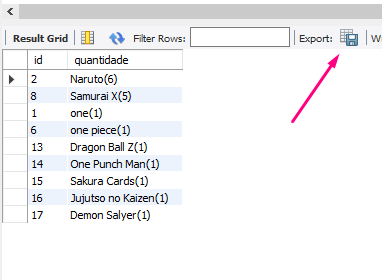

<h2 align="center">
  🔥 Desafio Kitsu - Firedev IT :coffee: 🔥
</h2>

<p align="center">
 <a href="#-solução">Solução</a> •
 <a href="#-tecnologias">Tecnologias</a> •
 <a href="#-Banco">Banco</a> •
  <a href="#-Documentacao">Documentação</a> •
 <a href="#-ferramentas">Ferramentas</a> •
  <a href="#-testes">Testes</a> •
 <a href="#-licença">Licença</a>
</p>

## 💡 Solução
Para o problema proposto o primeiro passo foi realizar uma análise da API com as rotas necessárias para retornar os dados requisitados.
Aps essa verificação, com as rotas já pre selecionadas, foi necessário então encontrar um framework que fizesse o consumo dessa API e o manipulasse com  o SpringBoot em Java.
Para esse objetivo foi utilizado o framework <b>Open-Feign</b>.

Encontrado essas respostas, então agora seria preciso desenhar uma forma arquitetural de quais camadas iriam ser necessarias, visto que também faria parte do problema a implantação de uma Estrutura no <b>Banco de dados</b>. Feito isso, a estrutura ficou dividida da seguinte forma: Camada Model, camada Services, camada repository e camada rest.

## 💻 Tecnologias

## 📐 Banco de Dados
Para a solução desse problema, pensei em criar uma tabela que representasse a entidade de pesquisa. Ela contem três atributos: Id, Moment e Busca, utilizando o MySQL então criei essa tabela e com o auxilio do spring integrei o banco de dados a uma classe mapeada pelo JPA com um repository para gerar um gatilho toda vez que a rota de Pesquisa fosse acionada iria criar um registro nessa tabela.

O metodo de inserção no banco de dados, foi criado utilizando o <b>EntityManager</b> que é um serviço que permite sincronizar operações com banco de dados personalizando essas consultas conforme a necessidade.

### Configurando o Banco de dados:
```bash
# Criando um Banco de dados:
Create table tb_pesquisa(
 id int PRIMARY KEY auto_increment, moment timestamp, busca varchar(255)
 );
```
```bash
USE tb_pesquisa;
# Inserindo valores
INSERT INTO tb_pesquisa(id, moment, busca) VALUES (null, NOW(), "Samurai X");
INSERT INTO tb_pesquisa(id, moment, busca) VALUES (null, NOW(), "Dragon Ball Z");
INSERT INTO tb_pesquisa(id, moment, busca) VALUES (null, NOW(), "One Punch Man");
INSERT INTO tb_pesquisa(id, moment, busca) VALUES (null, NOW(), "Sakura Cards");
INSERT INTO tb_pesquisa(id, moment, busca) VALUES (null, NOW(), "Jujutso no Kaizen");
INSERT INTO tb_pesquisa(id, moment, busca) VALUES (null, NOW(), "Demon Salyer");
INSERT INTO tb_pesquisa(id, moment, busca) VALUES (null, NOW(), "Naruto");
INSERT INTO tb_pesquisa(id, moment, busca) VALUES (null, NOW(), "Naruto");
```
```bash
# Gerando relatório
SELECT  distinct id, CONCAT(busca, "(",count(id),")") AS quantidade FROM tb_pesquisa GROUP BY busca ORDER BY count(id) DESC;
```
<p align="center">
  
</p>
## 📝 Documentação
### -Documentação das classes
Para documentar o código, foi utilizado o Javadoc. Acesse a pasta doc, e execute o arquivo: "index.html" para poder abrir toda a documentação formatada pelo javadoc.
### -Documentação da API
Documentação hospedada pelo Heroku.
https://firedev-guilhermesoterio.herokuapp.com/swagger-ui/index.html

## 🛠 Ferramentas

- [Spring Tools Suite 4](https://spring.io/tools) - IDE de desenvolvimento de aplicações Spring.
- [Postman](https://www.postman.com/) - documentação das requisições API REST.
- [Swagger](https://swagger.io) - framework para documentar as rotas da API.

## Testes
        Foram implementados testes unitarios cobrindo todas as entidades e classes presentes.
<br>• Testes na camada model
<br>• Testes na camada Service
<br>• Testes na camada Rest
      
#### Como rodar os testes?
Na pasta raiz, navegue para a pasta <b>src</b> > <b>test </b> com o botão direito do mouse no: <b>src/test/java</b> clique no Run as> Junit Test


#### Links
<br>
<br>
<br>
<br>
---
Realizar consultas na API [https://kitsu.docs.apiary.io](https://kitsu.docs.apiary.io)

Construir os seguintes endpoints:
 - Retorno dos animes mais populares;
 - Retorno dos mangas mais populares;
 - Buscar anime ou manga com filtros (título, ano, etc);
 - Obter informações de um anime ou manga;
 - Obter informações de um episodio de um anime especifico;

## Regras

 1. Linguagens JAVA ou PHP.
 2. Poderá ser feito utilizando qualquer framework.
 3. O código deve ser orientado a objeto.
 4. Deve ser versionado usando o git e disponibilizado no GitHub ou Bitbucket.
 5. Descrever no README do projeto as especificações, tecnologias e demais informações do projeto.

## Plus

 1. Deploy no Heroku.
 2. Criar estrutura no banco para salvar as buscas do usuário.
 3. Criar um relatório de itens mais pesquisados com base na estrutura criada.

## O que apreciamos?

 - Organização;
 - Simplicidade;
 - Objetividade;
 - Reúso de código;
 - Testes unitários e ou de integração;
 - Padronização de código;
 - Padrões de projeto;
 - Documentação de código e endpoints.

## Quem buscamos?

Queremos uma pessoa que goste do que faz, trabalhe em equipe e tenha vontade de inovar, buscando sempre atualização e soluções inovadoras.

Se você se identificou, venha fazer parte do nosso time!

## 

Qualquer duvida pode entrar em contato com o recrutador.

_Não precisa desenvolver uma interface gráfica, porem é um diferencial._
